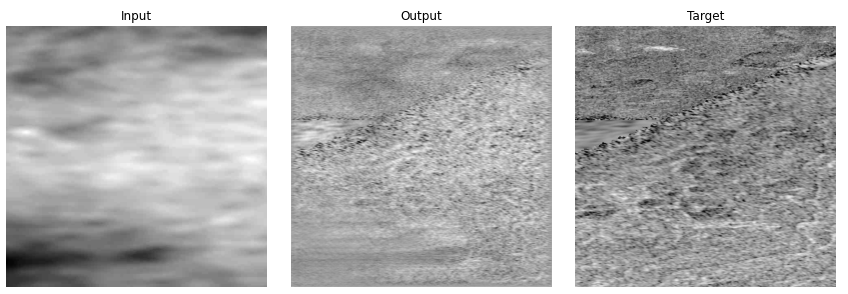

# Titan Surface Super-Resolution with Deep Learning

This project implements a deep learning pipeline to upscale low-resolution imagery of Titan’s surface using data from NASA’s Cassini mission. The core model is a U-Net trained with a combination of L1, adversarial, and perceptual losses to enhance realism and structural fidelity.

## Overview

- **Objective:** Enhance the spatial resolution of Titan's surface imagery using deep learning.
- **Data Source:** Cassini Synthetic Aperture Radar (SAR) imagery from NASA’s Planetary Data System.
- **Model Architecture:** U-Net generator with a PatchGAN-style discriminator.
- **Training Strategy:** Adversarial training with multiple loss functions to balance sharpness, realism, and accuracy.

## 📁 Project Structure
Although this structure is not provided in the repository (because of file-size limitations), it can easily be rebuilt using the [low-res](https://photojournal.jpl.nasa.gov/catalog/PIA22770) and [high-res](https://astrogeology.usgs.gov/search/map/titan_cassini_sar_hisar_global_mosaic_351m) images.
The test/ folder simply needs an image pair with the same name in their respective folders.
```
model
├── references
│   ├── highres.tif
│   └── lowres.tif
├── save
│   └── generator_base.pth
├── test
│   ├── highres
│   ├── lowres
│   └── upscaled
├── titan-full.ipynb
└── training
    ├── highres
    └── lowres
```
## 🧠 Methodology

### Preprocessing
- Images were split into 64x64 tiles with <1% missing pixels.
- Only ~20% of Titan’s surface met the quality threshold for training.

### Model
- **Generator:** U-Net with skip connections for spatial detail retention.
- **Discriminator:** PatchGAN to assess realism at the patch level.
- **Loss Functions:**
  - `L1 Loss`: Promotes structural similarity and smoothness.
  - `Adversarial Loss`: Drives realism and texture.
  - `Perceptual Loss`: Encourages semantic fidelity and high-level detail.

### Training
- Images downsampled using bicubic interpolation for input/target pairing.
- Best results observed between 100–200 epochs.
- Adversarial loss weight was tuned to balance realism and stability.

## 🧪 Results

- The trained model produces outputs with improved clarity, especially in structural boundaries and smooth textures.
- Realism is enhanced by adversarial training while avoiding overfitting.



